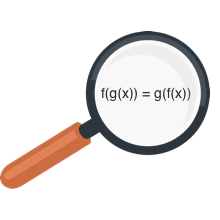
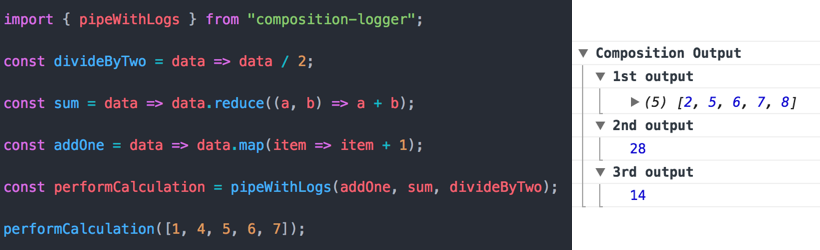

# Composition Logger

## 

### Installation

To install ( _recommended to save as a dev dependency_ )

`npm install composition-logger --save -dev`

### What is this?

From all the resources that I have seen, the recommended way to debug functional compositions in javascript is to provide a function that produces a side effect such as logging to the conosle and continue to pass the data through the composition, such as the trace function below.

This is all well and good but it poses a few limitations such as:

* Not beginner friendly. Beginners need to understand how functional composition works in order to debug or gain insight in how the data flows through a composition.

* Debugging methods such as `trace` can be tedious to work with. Lets say your composition contains a bug, in order to view the data between each step of the compositon, you would be required to manually add the `trace` function between each step of the composition.

So how can we do better? By utilizing [console.group](https://developer.mozilla.org/en-US/docs/Web/API/Console/group) and this is exactly what composition-logger does.

composition-logger logs each step of your composition in an organized manner without interuptting the data flow of your composition, making it effortless to debug and giving you continous insight into your functional compositions.

### Usage

Composition-logger supports two ways of composing functions, which are [pipe](http://ramdajs.com/docs/#pipe) & [compose](http://ramdajs.com/docs/#compose)

#### Pipe

#### Compose

  
  

